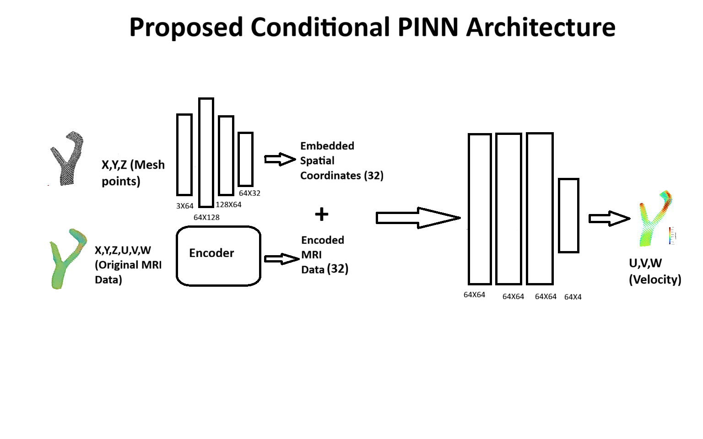
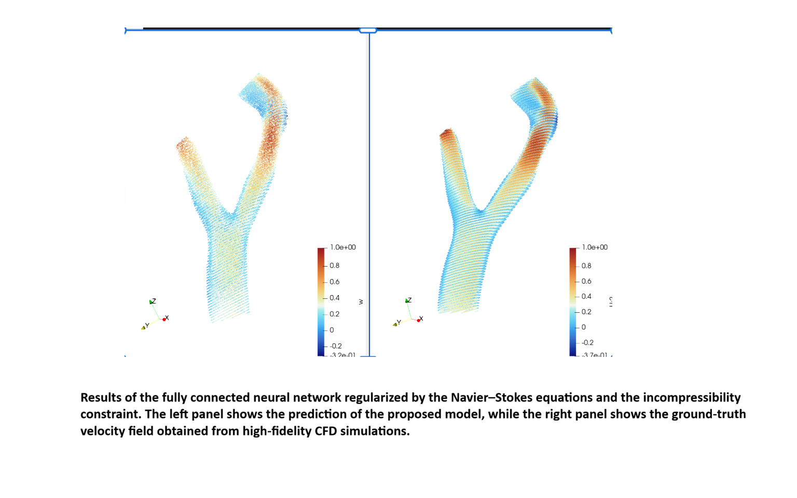

# Master-Thesis-on-PINN

This repository presents the data and experimental results of my Master’s thesis on Physics-Informed Neural Networks for 4D Flow MRI reconstruction in cardiovascular applications. The project focuses on improving model generalization across patients by incorporating patient-specific conditioning mechanisms.

## Background

From the literature on PINNs, it is known that existing approaches—ranging from fully connected neural networks to more recent methods such as Gaussian splatting—can achieve strong performance on individual patients. However, despite these promising results, most models do not generalize well to unseen patients.

## Objective

The main objective of this project is to design a model that achieves better generalization by conditioning the network on patient-specific information.

## Model Architecture

## Current Progress

So far, we have developed a model that performs well on a single patient. The preliminary results are shown below.

## Velocity Prediction

## Ongoing Research on generalize to unseen data 
After developing a well-performing model conditioned on patient-specific information, we are now testing our method on different datasets to evaluate whether it can generalize to unseen patients.

